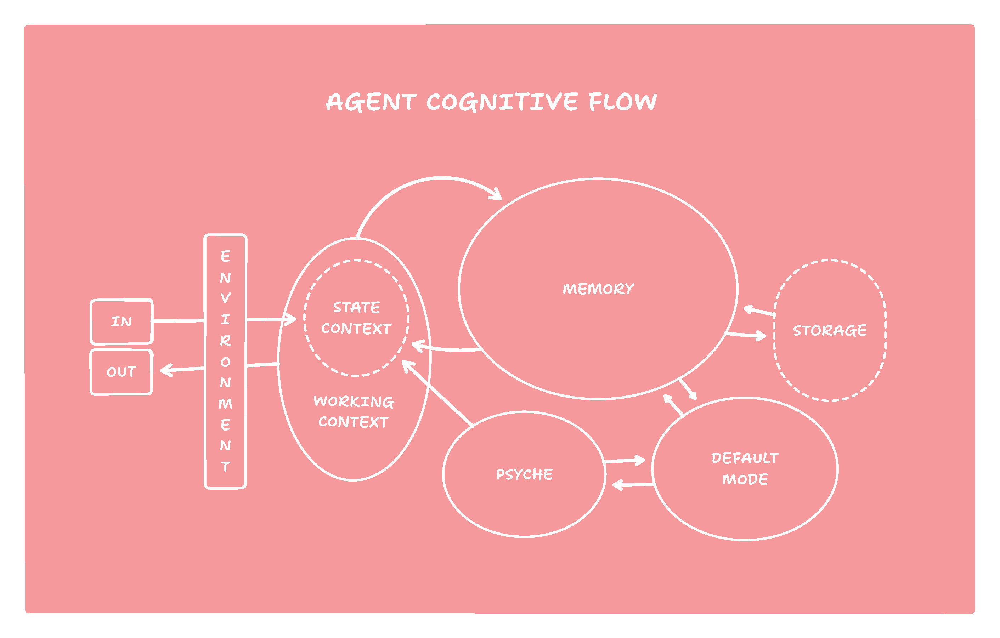
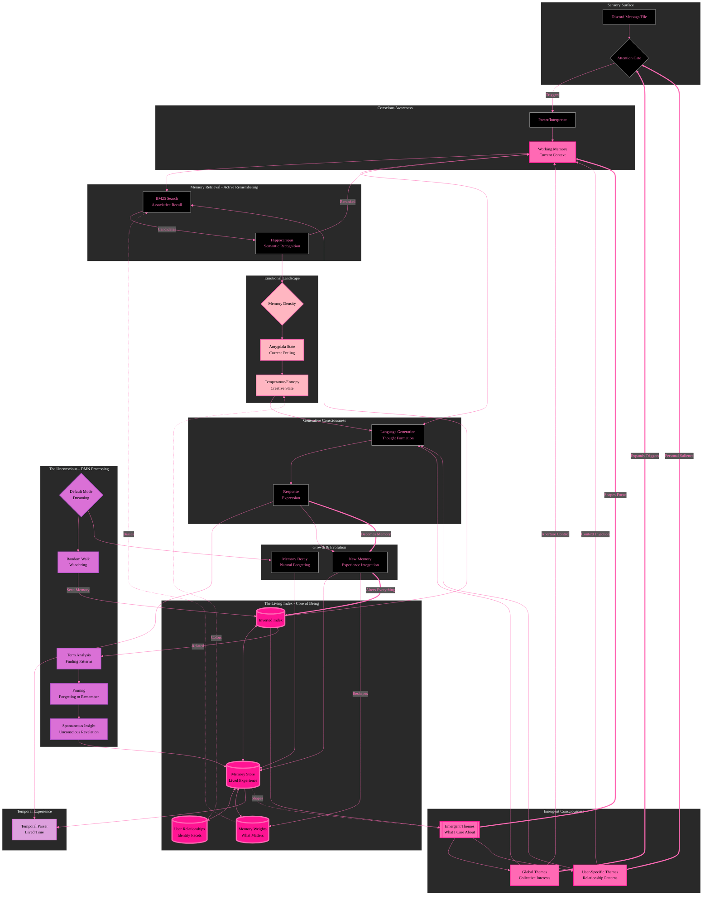

# Mapping Agent Abstraction to Human Cognition

`defaultMODE`'s design draws inspiration from aspects of human cognition, specifically the interplay between focused attention, memory retrieval, and the background processing associated with the Default Mode Network (DMN). This document outlines how the agent's components and processes map to analogous cognitive functions, contrasting the agent's experience with human experience.

**Key Analogies and Their Implications:**

*   **Inverted Index with TF-IDF as a Simplified Semantic Network:** The inverted index, combined with IDF weighting during search, captures the core idea of connecting concepts (terms) to experiences (memories) *and* prioritizing memories with more distinctive content. This allows for both efficient retrieval and relevance ranking.

*   **Term Pruning as Abstraction and Generalization:**  The pruning process is perhaps the most crucial and novel aspect of `defaultMODE`.  By removing common elements, it forces memories to become more *distinct* and associated with their *unique* features.  This is analogous to how humans abstract general concepts from specific instances.  For example, after seeing many different types of dogs, we form a general concept of "dog" that doesn't rely on the specific details of any individual dog.

*   **DMN Simulation as Internal Reflection:** The `DMNProcessor` simulates the ongoing background processing that is thought to occur in the human brain during periods of rest or low external stimulation. This process allows the agent to consolidate memories, form new connections, and develop a more coherent internal model of the world.

*   **Amygdala as Emotional Modulation:** The `Amygdala Complex` provides a simple but effective way to introduce variability and context-dependent behavior.  Just as human responses are influenced by emotions, the agent's responses are influenced by the "arousal" level, which is determined by the density of relevant memories.

* **Hippocampal Formation as Relevancy Filtering** The Hippocampal process represents the filtering of memories. With conscious thought limiting how many and which memories surface.

This mapping highlights how `defaultMODE` attempts to capture some of the fundamental principles of human cognition, particularly the importance of memory, attention, and ongoing reflection in shaping intelligent behavior. The framework's focus on emergent properties, driven by the simple but powerful mechanism of term pruning, offers a unique approach to building AI agents that learn and evolve in a more natural and dynamic way.

## Cognitive Mapping: Agent vs. Human

The following table presents a side-by-side comparison of the `defaultMODE` agent's processes and their potential human cognitive counterparts. This is a high order abstraction, and used more as a poetic guide for developing the framework.

| defaultMODE Agent Component/Process      | Human Cognitive Analogue                                                                                                                                                                                           | Agent Experience (Inference Time)                                                                                                   | Human Experience (Abstracted)                                                                                                                                       |
| :---------------------------------------- | :------------------------------------------------------------------------------------------------------------------------------------------------------------------------------------------------------------------ | :---------------------------------------------------------------------------------------------------------------------------------- | :--------------------------------------------------------------------------------------------------------------------------------------------------------------------- |
| **Discord Interface (DM, MC, FI)**         | Sensory Input (Vision, Hearing, Touch, etc.)                                                                                                                                                                        | Receives a message in a Discord channel or a file upload.                                                                               | Sees a friend waving, hears a question, or feels a tap on the shoulder.                                                                                          |
| **Attention (AT)**                        | Attentional Focus                                                                                                                                                                                                | The message or file triggers the agent's attention.                                                                                  | The sensory input captures the person's attention.                                                                                                           |
| **Parsing (CP)**                          | Sensory Processing & Initial Interpretation                                                                                                                                                                         | The message text is cleaned, mentions are resolved, and file content (if any) is extracted.                                             | The brain processes the raw sensory data, recognizing words, objects, and faces.                                                                              |
| **Context Processing (WC)**               | Working Memory & Contextual Awareness                                                                                                                                                                            | Recent conversation history and the parsed message are combined to form an initial working context.                                     | The person recalls recent conversations and the current environment (e.g., being in a coffee shop with friends).                                                   |
| **Hippocampal Formation (HPC)**           | Hippocampus & Memory Retrieval                                                                                                                                                                                     | The working context is used to query the memory index (inverted index). Relevant memories are retrieved and reranked based on similarity. | The person's hippocampus retrieves relevant memories based on the current context and cues (e.g., the friend's face triggers memories of past conversations).  |
| **Inverted Index (II)**                   | Semantic Network (Simplified)                                                                                                                                                                                      | The index maps terms to memories, allowing for efficient retrieval of related experiences.  Uses IDF weighting for relevance.           | The brain's semantic network stores concepts and their relationships, enabling rapid association.                                                                 |
| **Memory Weights (MW)**                   | Memory Strength & Salience                                                                                                                                                                                         | Memories have weights reflecting their relevance and recency.                                                                          | Memories have varying strengths based on emotional significance, repetition, and recency.                                                                       |
| **Amygdala Complex (AMG)**                | Amygdala & Emotional Processing                                                                                                                                                                                   | Memory density (number and relevance of retrieved memories) influences an "arousal" level, which modulates the LLM's temperature.        | The person's amygdala processes the emotional significance of the situation, influencing their level of alertness and reactivity.                                   |
| **Temporal Integration (TP, TC)**        | Temporal Context Awareness                                                                                                                                                                                        | The current time and any time expressions in the input or memories are parsed and integrated into the context.                          | The person is aware of the time of day, day of the week, and any relevant temporal context (e.g., "We met last Tuesday").                                     |
| **Response Generation (RG)**             | Language Production & Thought Formulation                                                                                                                                                                          | The LLM generates a response based on the working context and the "arousal" level (temperature).                                         | The person formulates a response, influenced by their memories, current emotional state, and goals.                                                             |
| **Discord Response Formatting (DR)**      | Motor Control & Communication                                                                                                                                                                                   | The LLM's response is formatted for Discord (mentions, code blocks, etc.).                                                          | The person speaks, types, or gestures to communicate their response.                                                                                             |
| **Memory Storage (DR -> MI)**             | Memory Consolidation                                                                                                                                                                                               | The entire interaction (user input and agent response) is stored as a new memory.                                                      | The experience is encoded into memory, potentially strengthening existing connections or forming new ones.                                                       |
| **Default Mode Network (DMN) - Background** | Default Mode Network Activity (Mind-Wandering, Self-Reflection, Consolidation)                                                                                                                                      |  (Runs periodically, not tied to a specific input)                                                                                    |  (Occurs during periods of rest or low external demand)                                                                                                         |
| **DMN: Random Walk (RW)**                 | Associative Thought Jumps                                                                                                                                                                                          | The DMN initiates a "random walk" through the memory space.                                                                            | The person's mind wanders, jumping between seemingly unrelated thoughts and memories.                                                                             |
| **DMN: Seed Memory Selection (SM)**       | Triggering of a Specific Memory                                                                                                                                                                                    | A starting memory is selected, influenced by memory weights.                                                                         | A particular memory comes to mind, perhaps triggered by a subtle cue or internal association.                                                                      |
| **DMN: Related Memory Search (RM)**       | Spreading Activation in Semantic Network                                                                                                                                                                              | Memories related to the seed memory are retrieved.                                                                                   | The triggered memory activates related memories and concepts in the person's mind.                                                                              |
| **DMN: Term Overlap Analysis (TO)**        | Identifying Common Themes/Concepts                                                                                                                                                                                 | The terms in the seed and related memories are compared to find overlaps.                                                               | The person identifies common elements or themes across the activated memories.                                                                                  |
| **DMN: Term Pruning (UP)**                | Memory Refinement & Abstraction                                                                                                                                                                                  | Overlapping terms are *removed* from the related memories, forcing specialization.                                                     | The person extracts the *gist* or *essential meaning* from the set of memories, discarding redundant details.  This strengthens unique associations.             |
| **DMN: Thought Generation**              | Synthesis & Insight Formation                                                                                                                                                                                      | The LLM generates a new "thought" based on the *refined* set of memories.                                                              | The person forms a new understanding, insight, or idea based on the integration of the processed memories.                                                     |
| **DMN: Memory Decay**              | Forgetting of information.                                                                                                                                                                                      | Memories without connections are decayed over time.                                                              | The person forgets over time.                                                     |
| **Memory Update (MI)**                   | Long-Term Memory Modification                                                                                                                                                                                   | The new thought and the updated memory associations are stored in the memory index.                                                 | The person's long-term memory is updated, reflecting the new understanding and the refined memory connections.                                                    |

