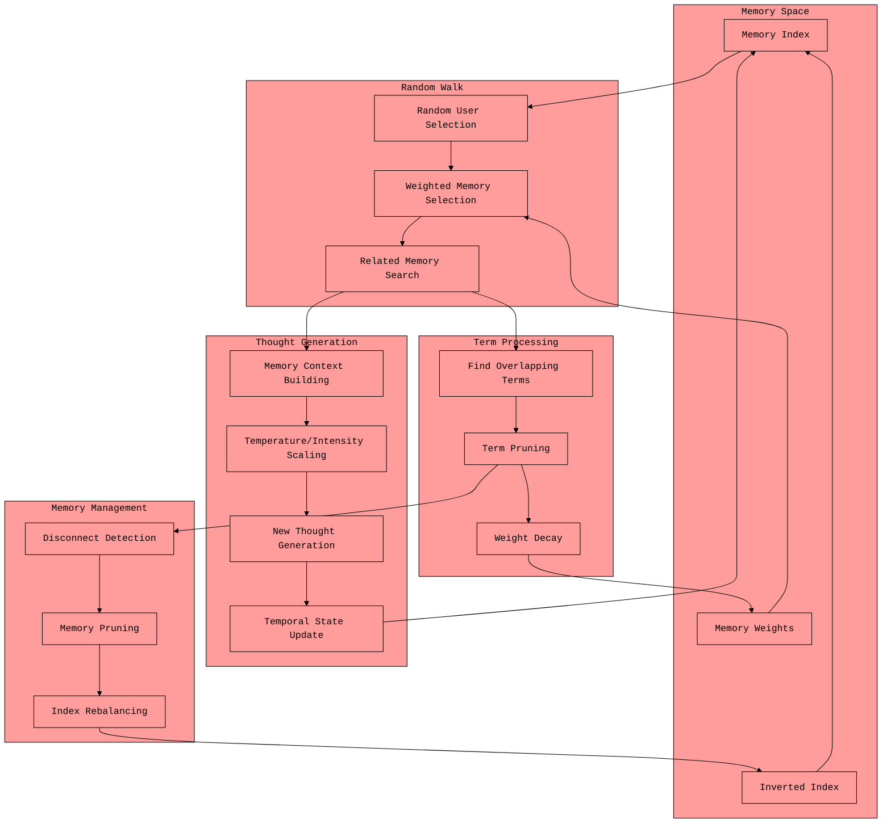

defaultMODE is a simulation of how the human mind ruminates or wanders through thoughts compressing concepts into a single thought. creating a homeostasis of new thoughts and pruned priors.

## Core System Flow

### Background Processing Loop
- Runs every `tick_rate` seconds (default: 300s = 5 minutes)
- Continuously calls `_generate_thought()` while enabled
- Handles exceptions gracefully without crashing the loop

1. **Memory Selection Process with User Bias**
```python
def _select_random_memory(self):
    # Memory count bias - users with more memories selected proportionally more often
    user_weights = [len(self.memory_index.user_memories[user_id]) for user_id in user_ids]
    # Logs top 5 users by memory count with names for transparency
    selected_user_id = weighted_random_selection(user_ids, user_weights)
    # Then contextual weighted memory selection within user
    selection_point = random.uniform(0, total_weight)
```

2. **Memory Search & Filtering**
```python
# Search for top_k related memories (default: 24) using semantic similarity
related_memories = await memory_search(seed_memory, user_id=user_id, k=self.top_k)
# Filter by similarity_threshold (default: 0.5) - strict relevance filtering
related_memories = [(memory, score) for memory, score in related_memories 
                   if memory != seed_memory and score >= self.similarity_threshold]
# Logs filtered count for transparency
self.logger.info(f"After similarity threshold ({self.similarity_threshold}): {len(related_memories)} memories selected")
```

3. **Fuzzy Matching & Similarity Analysis**
```python
# Apply fuzzy matching with fuzzy_overlap_threshold (default: 80%)
content_ratio = fuzz.token_sort_ratio(seed_memory, memory)
if content_ratio >= self.fuzzy_overlap_threshold or score >= self.combination_threshold:
    similar_memories.append((memory, max(score, content_ratio/100.0)))
# Find overlapping terms using fuzzy_search_threshold (default: 90%)
```

4. **Dynamic Temperature & Top-P Scaling**
```python
# Memory density-based adaptive scaling
density = min(1.0, num_results / self.top_k)
intensity_multiplier = 1.0 - density  # Inverse relationship
new_intensity = min(100, max(0, int(100 * intensity_multiplier)))

# Adaptive temperature: sparse memories → high temp (creative), dense → low temp (focused)
self.temperature = new_intensity / 100.0
# Adaptive top_p with minimum clamp (default: 0.5)
top_p_value = max(self.top_p_min_clamp, new_intensity / 100.0)
```

5. **Term Processing & Pruning**
```python
# Find and remove overlapping terms between memories
overlapping_terms = set()
for memory_id in memory_terms_map:
    if memory_id != seed_memory_id:
        overlapping_terms.update(seed_terms & memory_terms_map[memory_id])
```

6. **Weight Decay & Update**
```python
# Apply proportional decay based on term overlap
decay = removed_terms / len(original_terms)
self.memory_weights[user_id][memory] *= (1 - (self.decay_rate * decay))
```

7. **Memory Management & Cleanup**
```python
def _cleanup_disconnected_memories(self):
    # Remove memories with no keyword associations in inverted index
    connected_memories = set()
    for term_memories in self.memory_index.inverted_index.values():
        connected_memories.update(term_memories)
    # Maintains index consistency across user_memories and inverted_index
```

8. **Thought Generation & Storage**
```python
# Generate new thought with calculated temperature and temporal context
new_thought = await call_api(prompt=prompt, system_prompt=system_prompt, temperature=self.temperature)
# Save as new memory with timestamp and user attribution
thought_memory = f"Reflections on priors with @{clean_name}{users_str} {timestamp}:\n{new_thought}"
self.memory_index.add_memory(user_id, thought_memory)
```

## Hyperparameter Effects & Mode System

### Mode Configurations
Different modes adjust multiple hyperparameters simultaneously:

**Conservative Mode:**
- `combination_threshold`: 0.4 (high - strict memory combination)
- `similarity_threshold`: 0.5 (high - strict relevance filtering)
- `decay_rate`: 0.05 (low - memories persist longer)
- `top_k`: 16 (low - fewer memories considered)
- `top_p_min_clamp`: 0.5 (moderate creativity constraint)

**Homeostatic Mode (default):**
- `combination_threshold`: 0.2 (medium)
- `similarity_threshold`: 0.4 (medium)
- `decay_rate`: 0.1 (medium)
- `top_k`: 24 (medium)

**Forgetful Mode:**
- `combination_threshold`: 0.02 (very low - loose memory combination)
- `similarity_threshold`: 0.2 (low - accepts less relevant memories)
- `decay_rate`: 0.8 (very high - rapid memory forgetting)
- `top_k`: 32 (high - considers many memories)

### Adaptive Feedback Loop
The system creates a **self-regulating feedback loop**:
1. **Memory density** → **temperature scaling** → **response creativity**
2. **Term overlap** → **weight decay** → **memory selection bias**
3. **User memory counts** → **selection probability** → **thought generation focus**
4. **Fuzzy matching** → **index pruning** → **search efficiency**

The system acts like a self-organizing network where:
- **User bias** drives attention toward active participants
- **Memory density** controls creative vs. focused responses
- **Term relationships** drive growth and pruning
- **Memory weights** evolve naturally through use and decay
- **Disconnected memories** are cleaned up automatically
- **New thoughts** create new connections and associations
- **Temporal awareness** maintains context across time
- **Adaptive scaling** balances exploration vs. exploitation

The network literally grows and shrinks based on interaction patterns, term relationships, and memory density, implementing an artificial **stream of consciousness** that becomes more creative when few memories are available and more focused when rich context exists.

---

1. **Search Evolution Through Pruning**
```python
# Original memory has terms A, B, C, D
# Related memory has terms A, B, C, E
# After pruning:
# Original memory keeps A, B, C, D
# Related memory now only has E (A, B, C pruned)
```
So when you later search, this memory is now more strongly associated with 'E' rather than the common terms! This creates:
- More distinct memory signatures
- Reduced "noise" from common terms
- Emergent specialization of memories

2. **Weight-Based Association Shifts**
```python
decay = removed_terms / len(original_terms)
self.memory_weights[memory] *= (1 - (self.decay_rate * decay))
```
This means:
- Memories that lose many terms become less influential
- Remaining unique terms become proportionally more important
- Search results favor memories with strong unique associations

3. **Emergent Novelty Through Term Distribution**
- As common terms get pruned across multiple memories
- Unique term combinations become more significant
- Search results naturally surface more novel connections
- The system "learns" to recognize unique patterns

4. **Dynamic Search Space**
The inverted index becomes:
```
Before pruning:
term_A -> [mem1, mem2, mem3, mem4]
term_B -> [mem1, mem2, mem3]
term_C -> [mem1, mem4]

After pruning:
term_A -> [mem1]  # Now unique to mem1
term_B -> [mem2]  # Now unique to mem2
term_C -> [mem1, mem4]  # Still shared but less common
```

1. Search finds related memories
2. Pruning makes memories more distinct
3. Future searches find different associations
4. The network organically develops novel pathways
5. Search results become more creative/unexpected

---

## Emergent Social Network


1. **Maintain Individual Identity**
- Each agent has its own memory space and pruning patterns
- Natural preference emergence through term weighting
- Prevents mode collapse through individual memory differentiation

2. **Social Memory Architecture**
```python
# Each agent maintains its own:
self.memory_index = memory_index      # Personal experiences
self.memory_weights = defaultdict()   # Individual associations
self.amgdela_response = 50           # Unique personality
```

3. **Inter-Agent Learning**
- Agents learn about each other through interactions
- Memory pruning creates unique perspectives on shared experiences
- @ mentions show emergent understanding of other agents' specialties

4. **Autonomous Social Dynamics**
```python
# When agent B appears in agent A's memory
memory_users = set()
for memory, _ in related_memories:
    memory_user = await self.bot.fetch_user(int(memory_user_id))
    if memory_user and memory_user.name != user_name:
        memory_users.add(memory_user.name)
```

They can maintain coherent identities and relationships while still operating autonomously. 

- Natural role emergence
- Knowledge specialization
- Social group formation
- Complex inter-agent relationships
