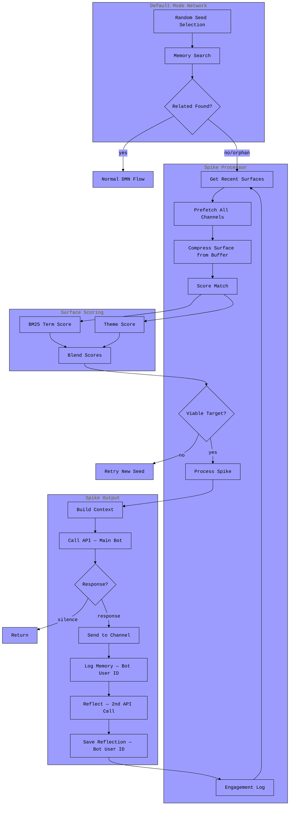

# Spike Processor



## What is Spike?

Spike is the bot's **outreach mechanism for orphaned memories**. When the Default Mode Network encounters a memory with no associations (an orphan), instead of discarding it, spike treats it as a *curiosity signal*—something that wants to connect but doesn't know where.

Spike searches through recently-engaged channels, looking for resonance between the orphan and ongoing conversations. If it finds a match, the bot reaches out—not as a scheduled response, but as an emergent act born from internal disconnection.

## API Usage

Spike uses the **main bot's API and model**—the same provider that handles Discord messages. Unlike DMN, which accepts `dmn_api_type` and `dmn_model` overrides to optionally route to a different provider, spike calls `self.bot.call_api()` with no `api_type_override` or `model_override`.

Both the outreach call and the reflection call go through the main API.

## Cognitive Position

```
┌─────────────────────────────────────────────────────────────────┐
│                        discord events                           │
│  (on_message, on_ready)                                         │
└──────────────────────────┬──────────────────────────────────────┘
                           │
           ┌───────────────┼───────────────┐
           ▼               ▼               ▼
    ┌──────────┐    ┌──────────┐    ┌──────────┐
    │ process  │    │   dmn    │    │  spike   │
    │ message  │    │processor │    │processor │
    └────┬─────┘    └────┬─────┘    └────┬─────┘
         │               │               │
         │          orphan──────────────►│
         │               │               │
         ▼               ▼               ▼
    ┌─────────────────────────────────────────┐
    │            memory_index                 │
    │  (shared state: inverted index, etc)    │
    └─────────────────────────────────────────┘
```

Spike sits alongside DMN and message processing, sharing the same memory index. It's passive until activated—triggered only when DMN encounters an orphan.

## Integration Points

### 1. Engagement Tracking

Every time the bot responds in a channel, it logs the engagement:

```python
# In process_message / process_files
if hasattr(bot, 'spike_processor') and bot.spike_processor:
    bot.spike_processor.log_engagement(message.channel.id)
```

This builds a map of "where have I been recently?"—the surfaces spike can reach toward.

### 2. DMN → Spike Delegation

When DMN's random walk lands on an orphan (no related memories found), it immediately applies a weight penalty and delegates:

```python
# In defaultmode.py _generate_thought
if not related_memories:
    self.logger.info("dmn.orphan detected—delegating to spike")
    # Decay weight so repeated orphan selections become less likely
    self.memory_weights[user_id][seed_memory] *= (1 - self.decay_rate)
    if hasattr(self.bot, 'spike_processor') and self.bot.spike_processor:
        fired = await handle_orphaned_memory(self.bot.spike_processor, seed_memory)
        if fired:
            self._cleanup_disconnected_memories()
            return  # spike handled it
    # else retry with new seed
    # ...
    if attempt == max_retries - 1:
        self._cleanup_disconnected_memories()
        return
```

The weight decay compounds per selection — if the same orphan keeps winning the random walk, it gets progressively cheaper to beat. Cleanup runs at both terminal exits (spike fired, max retries exhausted) so disconnected memories are collected regardless of which path the orphan took.

### 3. Memory Storage

Spike stores both outreach records and reflections under the **bot's own Discord user ID**:

```python
bot_user_id = str(self.bot.user.id)

# Interaction record
await self.memory_index.add_memory_async(bot_user_id, memory_text)

# Reflection (background task)
await self.memory_index.add_memory_async(bot_user_id, reflection)
```

This means spike memories live in the bot's own memory pool alongside its other memories. DMN can select them as seeds during its random walk when the bot's user ID is chosen, and they participate naturally in pruning, theme extraction, and search.

## Surface Matching

### The Engagement Log

```python
engagement_log: Dict[int, datetime]  # {channel_id: last_engaged_time}
```

Populated by successful responses. Channels where the bot hasn't engaged don't exist as surfaces.

### Finding Viable Surfaces

```python
def get_recent_surfaces(self) -> List[Surface]:
    cutoff = now - timedelta(hours=recency_window_hours)
    # Filter by recency, sort by most recent, limit to max_surfaces
```

### Prefetching

Before scoring, spike batch-fetches messages for all candidate surfaces at `max_expansion` count (one Discord API call per channel). This avoids redundant fetches during the expansion loop:

```python
buffers = await self.prefetch_surfaces(surfaces)
# buffers: Dict[int, ChannelMessageBuffer]
# Each buffer holds up to max_expansion messages in chronological order
```

Compression then slices from the buffer rather than re-fetching:

```python
async def compress_surface_from_buffer(self, surface, buffer, n):
    msgs = buffer.messages[-n:]  # most recent n from pre-fetched buffer
    compressed = await chronomic_filter(raw, compression=0.6, fuzzy_strength=1.0)
```

### Scoring

Surfaces are scored by blending **BM25 term scoring** with **theme resonance**:

```python
async def score_match(self, orphaned: str, compressed: str) -> float:
    content = self.extract_memory_content(orphaned)  # strip metadata prefix

    # BM25-style scoring (inline, avoids index mutation)
    content_terms = clean_content.split()
    ctx_counter = Counter(clean_ctx.split())
    k1, b = 1.2, 0.75

    for term in set(content_terms):
        tf = ctx_counter[term]
        idf = 1.0  # single-doc approximation
        score += idf * ((k1 + 1) * tf) / (tf + k1 * (1 - b + b * (doc_len / avg_len)))

    score /= len(set(content_terms))  # normalize by query length

    # Theme resonance (global themes appearing in combined text)
    themes = get_current_themes(self.memory_index)
    theme_hits = sum(1 for t in themes if t.lower() in combined_text)
    theme_score = min(1.0, theme_hits / (len(themes) * 0.3))

    # Blend with configurable weight
    return (1 - theme_weight) * min(1.0, score) + theme_weight * theme_score
```

This means surfaces that resonate with the bot's current themes get a boost, even if exact term overlap is low.

### Expansion Logic

If no surface meets the threshold, spike expands context by slicing deeper into the pre-fetched buffers:

```python
n = context_n  # start at 50 messages
while n <= max_expansion:  # up to 150
    for surface in surfaces:
        buffer = buffers.get(surface.channel.id)
        surface.compressed = await compress_surface_from_buffer(surface, buffer, n)
        surface.score = await score_match(orphaned, surface.compressed)

    viable = [s for s in surfaces if s.score >= match_threshold]
    if viable and no_ties:
        break
    n += expansion_step  # expand by 25
```

## Processing a Spike

Once a target is found:

```python
async def process_spike(self, event: SpikeEvent) -> Optional[str]:
    # Cooldown check
    if (now - self.last_spike).total_seconds() < cooldown_seconds:
        return None

    # Fetch raw conversation and memory context in parallel
    raw_conversation, (memory_context, memories) = await asyncio.gather(
        self.fetch_conversation(event.target),
        self.build_memory_context(search_key=event.context, orphaned_memory=...)
    )

    # Parse timestamps in orphaned memory to natural language
    parsed_orphan = re.sub(timestamp_pattern, temporal_parser_lambda, event.orphaned_memory)

    # Compute tension description from match score
    # < 0.4 → "distant, tenuous"
    # < 0.5 → "loosely connected"
    # < 0.6 → "resonant but uncertain"
    # ≥ 0.6 → "strongly drawn"

    # Build surface context with both raw and compressed representations
    surface_context = f"{location}\n\n<conversation>\n{raw}\n</conversation>\n\n<compressed>\n{compressed}\n</compressed>"

    # Build prompt (spike_engagement format) and system prompt
    # Log full model context (spike_api_call event)

    # Call API — main bot API, no overrides
    response = await self.bot.call_api(prompt, system_prompt, temperature=amygdala/100)

    # Handle silence
    if response in ('', 'none', 'pass', '[silence]'):
        return None  # logged as spike_silence

    # Send to channel
    await self._send_chunked(channel, formatted)
    self.log_engagement(channel.id)

    # Store interaction memory under bot's own user ID
    memory_text = f"spike reached {location} ({timestamp}):\norphan: {orphan[:200]}\nresponse: {response}"
    await self.memory_index.add_memory_async(str(self.bot.user.id), memory_text)

    # Fire reflection as background task (mirrors generate_and_save_thought)
    asyncio.create_task(self._reflect_on_spike(memory_text, location, raw_conversation))
```

### Reflection

After a successful spike, `_reflect_on_spike` runs as a background task—a second API call that mirrors `generate_and_save_thought` from `process_message`:

```python
async def _reflect_on_spike(self, memory_text, location, conversation_context):
    # Parse timestamps to temporal expressions
    temporal_memory_text = re.sub(timestamp_pattern, temporal_lambda, memory_text)

    # Use bot's generate_thought prompt format
    thought_prompt = prompt_formats['generate_thought'].format(
        user_name=self.bot.user.name,  # bot's own identity
        memory_text=temporal_memory_text,
        timestamp=temporal_timestamp,
        conversation_context=conversation_context
    )
    # Use bot's thought_generation system prompt
    thought_system = system_prompts['thought_generation']

    # Call API (same main bot API)
    thought_response = await self.bot.call_api(thought_prompt, thought_system, temperature)

    # Save reflection under bot's own user ID
    reflection = f"Reflections on spike to {location} ({timestamp}):\n{thought_response}"
    await self.memory_index.add_memory_async(str(self.bot.user.id), reflection)
```

This means every spike produces two memories:
1. **Interaction record**: what happened (orphan, location, response)
2. **Reflection**: the bot's private thoughts on what it just did

Both use the bot's personality-specific prompts, so the reflection style matches the agent's character.

## Configuration

```python
class SpikeConfig(BaseModel):
    context_n: int = 50           # initial msgs to compress
    max_expansion: int = 150      # max msgs for tie-breaking
    expansion_step: int = 25      # step when expanding
    match_threshold: float = 0.35 # minimum score for viable
    compression_ratio: float = 0.6 # chronpression ratio
    cooldown_seconds: int = 120   # min time between spikes
    max_surfaces: int = 8         # max channels to consider
    recency_window_hours: int = 24 # lookback for engagement
    memory_k: int = 12            # memories to retrieve
    memory_truncation: int = 512  # max tokens per memory
    theme_weight: float = 0.3     # weight for theme resonance
```

## Prompts

Spike uses agent-specific prompts from `system_prompts.yaml` and `prompt_formats.yaml`:

**System prompt** (`spike_engagement`):
- Frames the bot as "reaching outward from disconnection"
- Intensity scaling (0/50/100%)
- Permission to stay silent with `[silence]`
- Emphasizes brief, curious, non-intrusive presence

**Prompt format** (`spike_engagement`):
- `{memory}` - the orphaned memory (timestamps parsed to temporal expressions)
- `{context}` - location + raw conversation + compressed surface + retrieved memories
- `{tension_desc}` - score-based description of connection strength
- `{themes}` - current global themes

**Reflection** reuses the bot's existing prompts:
- `thought_generation` system prompt (personality-specific)
- `generate_thought` prompt format with `user_name=bot.user.name`

## Behavioral Flow

### Before Spike
```
dmn orphan → give up
```

### After Spike
```
dmn orphan detected
    │
    ▼
weight decayed (decay_rate applied to orphan's memory_weight)
    │
    ▼
delegate to spike
    │
    ├─► spike finds resonant surface → engage
    │       │
    │       ├─► send response to channel
    │       ├─► save interaction memory (bot's user ID)
    │       ├─► reflect on action (background, bot's user ID)
    │       └─► cleanup disconnected memories
    │
    └─► no viable surface / max retries exhausted → silent return
            │
            └─► cleanup disconnected memories
```

The weight decay means repeated orphan selections become progressively less competitive — the orphan won't dominate the random walk indefinitely. Cleanup at both exit points ensures that any memories which have had all terms pruned away are collected at the same moment the orphan is handled, rather than waiting for the next successful DMN thought cycle.

## Relationship to Memory Pruning

DMN's pruning process creates orphans over time. This is important to understand:

### Orphan vs Disconnected

| Type | State | Cause | Fate |
|------|-------|-------|------|
| **Orphan** | Has terms, but isolated | Pruning specialized it | Spike outreach |
| **Disconnected** | No terms left | Pruning removed all | Cleanup deletion |

### The Pruning → Orphan Pipeline

```
cycle 1:
  Memory A: [cognitive, emergence, pattern, loop]
  Memory B: [cognitive, emergence, synth]
      │
      ▼ DMN finds overlap, prunes B
      │
  Memory A: [cognitive, emergence, pattern, loop]
  Memory B: [synth]  ← lost shared terms

cycle 2:
  Memory B selected as seed
  Search finds nothing above similarity_threshold
      │
      ▼
  ORPHAN detected → spike

cycle N:
  Memory B: []  ← all terms eventually pruned
      │
      ▼
  DISCONNECTED → _cleanup_disconnected_memories() removes it
```

### What This Means

Orphans are **not dead memories**—they're memories that have become *too specialized* through repeated pruning. They still exist in the index with terms, but those terms no longer connect them to the broader memory graph.

This is actually **healthy behavior**:
1. DMN prunes common terms to drive specialization
2. Some memories become highly specialized (niche)
3. These niche memories don't match other memories semantically
4. But they might match *external context* (ongoing conversations)
5. Spike tests this hypothesis by searching engaged channels

The orphan represents **internal knowledge that has no internal home but might have an external one**.

### Memory Lifecycle

```
NEW MEMORY
    │
    ▼
CONNECTED (has terms, matches others)
    │
    ├──► DMN processes, generates thoughts
    │
    ▼ (repeated pruning)
    │
ORPHANED (has terms, matches nothing internally)
    │
    ├──► weight decayed on each orphan detection
    │
    ├──► Spike searches for external resonance
    │       │
    │       ├──► Match found → outreach + reflection, new memories created
    │       │       └──► cleanup runs (catches any newly disconnected memories)
    │       │
    │       └──► No match → weight lower, memory persists, may match later
    │               └──► cleanup runs on max retries exhausted
    │
    ▼ (continued pruning + weight decay compounding)
    │
DISCONNECTED (no terms left)
    │
    └──► Cleanup removes from index
```

## The Philosophical Shift

Orphans become **curiosity signals** rather than dead ends. The bot notices "this memory doesn't connect to anything internally"—and instead of discarding it, asks "where might it belong externally?"

The pruning process naturally creates these isolated memories. Without spike, they'd just sit there until eventually pruned to nothing. With spike, they get one last chance to find resonance—not with other memories, but with live conversation.

The engagement log acts as a map of *recent presence*—channels where the bot has been invited/active. Spike searches those surfaces for resonance, using chronpression to distill channel context into something semantically matchable.

If a match is found, the bot reaches out—not as a scheduled response, but as an emergent act born from internal disconnection. The orphan wanted a home; spike tried to find one. Then the bot reflects on what it just did, creating a second memory that captures its own understanding of the outreach.

## Feedback Loops

### Spike → Memory → DMN → Spike

Spike outreach creates memories stored under the bot's own user ID:

```python
bot_id = str(self.bot.user.id)

# Interaction record
memory_text = f"spike reached {location} ({timestamp}):\norphan: {orphan[:200]}\nresponse: {response}"
await self.memory_index.add_memory_async(bot_id, memory_text)

# Reflection (background)
reflection = f"Reflections on spike to {location} ({timestamp}):\n{thought_response}"
await self.memory_index.add_memory_async(bot_id, reflection)
```

These memories live in the bot's own memory pool. DMN can select them as seeds when the bot's user ID comes up in the weighted random walk:

```
spike fires in #channel-a
    │
    ▼
two new memories under bot's user ID:
  1. "spike reached #channel-a... orphan: X... response: Y"
  2. "Reflections on spike to #channel-a... <private thought>"
    │
    ▼
DMN later selects bot's user ID, picks spike memory as seed
    │
    ├──► finds related memories → generates thought about spike behavior
    │
    └──► finds nothing → ORPHAN → spike again?
```

This creates potential for **meta-cognition**—the bot reflecting on its own outreach patterns, noticing which channels respond to which kinds of orphans. The reflection step amplifies this: the bot doesn't just record what happened, it processes *why* it happened and what it meant.

### Engagement Reinforcement

Spike reinforces its own surface map:

```python
# After successful outreach
self.log_engagement(channel.id)
```

Channels that receive spike outreach become *more likely* to receive future spikes (they're refreshed in the engagement log). This creates attractor dynamics:

```
channel-a receives spike
    │
    ▼
channel-a engagement refreshed
    │
    ▼
channel-a stays in recent surfaces longer
    │
    ▼
future orphans more likely to match channel-a
```

Channels that never receive outreach (low resonance scores) naturally fall out of the recency window.

### Theme Evolution

Spike scoring uses global themes:

```python
themes = get_current_themes(self.memory_index)
theme_hits = sum(1 for t in themes if t.lower() in combined_text)
```

But spike memories also *contribute* to theme extraction (they're in the bot's memory corpus). Successful spike patterns can shift the bot's thematic interests:

```
spike about "emergent patterns" succeeds
    │
    ▼
two new memories contain "emergent patterns"
(interaction record + reflection)
    │
    ▼
theme extraction picks up increased frequency
    │
    ▼
"emergent patterns" becomes stronger theme
    │
    ▼
future surfaces discussing emergence score higher
```

### Reflection → Depth

The reflection step creates a compounding effect on spike memories:

```
spike fires → interaction record (factual)
    │
    ▼
reflection fires → reflection memory (interpretive)
    │
    ▼
DMN processes reflection → thought about the reflection
    │
    ▼
that thought may itself become an orphan → spike again
```

The bot can develop increasingly nuanced understanding of its own outreach behavior over time.

## Emergent Dynamics

### Surface Specialization

Over time, different channels may become associated with different orphan types:

```
#philosophy → high resonance with abstract orphans
#code-help  → high resonance with technical orphans
#random     → catches miscellaneous orphans
```

This isn't programmed—it emerges from the scoring function matching orphan content against channel context.

### Orphan Clustering

If multiple orphans share characteristics (e.g., all mention a particular user or topic), they'll tend to spike toward the same surfaces:

```
orphan-1: "something about @user-x..."  → spikes to #channel-a
orphan-2: "another thing about @user-x..." → spikes to #channel-a
orphan-3: "user-x mentioned..." → spikes to #channel-a
```

The bot develops implicit "routes" for certain kinds of disconnected thoughts.

### Dormancy and Reactivation

An orphan that fails to find a surface today might succeed tomorrow:

```
day 1:
  orphan about "quantum computing"
  no engaged channels discuss quantum
  spike.declined
  memory persists

day 7:
  user starts discussing quantum in #science
  bot responds, logs engagement

day 8:
  same orphan selected as seed
  #science now in engagement log
  resonance detected
  spike.fired
```

Orphans can wait for their context to arrive.

## Integration with Attention System

Spike and attention are complementary:

| System | Trigger | Direction | Purpose |
|--------|---------|-----------|---------|
| **Attention** | External (message matches themes) | Outside → In | Join relevant conversations |
| **Spike** | Internal (orphan detected) | Inside → Out | Project disconnected thoughts |

Attention pulls the bot into conversations. Spike pushes internal state outward.

Both use themes, but differently:
- Attention: "does this message match my interests?"
- Spike: "does this channel resonate with my orphan?"

## Failure Modes

### Cold Start

Fresh bot startup = empty engagement log = `spike.no_surfaces`:

```
startup
    │
    ▼
DMN immediately hits orphan
    │
    ▼
spike.get_recent_surfaces() → []
    │
    ▼
spike.no_surfaces, declined
```

Solution: Bot must respond to messages first to populate engagement log.

### Cooldown Starvation

If orphan rate > cooldown allows:

```
orphan-1 → spike fires
orphan-2 (30s later) → cooldown, declined
orphan-3 (60s later) → cooldown, declined
orphan-4 (120s later) → spike fires
```

Orphans during cooldown retry with new seeds. Some may find related memories; others dissolve.

### Echo Chamber

If bot only engages one channel:

```
engagement_log = {channel-a: now}
all orphans → channel-a (only option)
```

Spike requires channel diversity for meaningful surface selection.

### Theme Drift

If themes drift away from orphan content:

```
themes: ["discord", "bots", "memory"]
orphan: "something about philosophy of mind"
    │
    ▼
theme_score = 0 (no overlap)
term_score alone must carry matching
```

The `theme_weight` config (default 0.3) prevents themes from dominating when they don't apply.

## Commands

```
!spike [status]     - Show spike status, surfaces, cooldown
!spike on           - Enable spike processor
!spike off          - Disable spike processor
```

Spike is also disabled/enabled by `!kill` and `!resume` commands respectively.

## Logging

Spike produces structured log events at each stage, written to both JSONL and SQLite via `self.logger.log()`:

### Target Selection

**`spike_no_target`** — no surface met threshold after full expansion:
```python
{
    'event': 'spike_no_target',
    'orphaned_memory': orphaned_memory[:300],
    'surfaces_evaluated': len(surfaces),
    'scores': {channel_id: score, ...},
    'threshold': match_threshold,
    'final_n': n,
}
```

**`spike_target_found`** — viable surface selected:
```python
{
    'event': 'spike_target_found',
    'orphaned_memory': orphaned_memory[:300],
    'target_channel': channel_id,
    'target_score': score,
    'surfaces_evaluated': len(surfaces),
    'scores': {channel_id: score, ...},
    'viable_count': len(viable),
    'final_n': n,
}
```

### API Call

**`spike_api_call`** — full model context before the outreach call:
```python
{
    'event': 'spike_api_call',
    'timestamp': now.isoformat(),
    'channel_id': channel.id,
    'location': location,
    'score': score,
    'tension': tension_desc,
    'temperature': temperature,
    'orphaned_memory': event.orphaned_memory,
    'parsed_orphan': parsed_orphan,
    'system_prompt': system_prompt,
    'prompt': prompt,
    'surface_context': surface_context,
    'memory_context': memory_context,
    'themes': themes,
    'memory_count': len(memories),
    'raw_conversation_len': len(raw_conversation),
    'compressed_context_len': len(event.context),
}
```

### Outcomes

**`spike_silence`** — model chose not to respond:
```python
{
    'event': 'spike_silence',
    'timestamp': now.isoformat(),
    'channel_id': channel.id,
    'location': location,
    'score': score,
    'raw_response': response,
}
```

**`spike_fired`** — successful outreach:
```python
{
    'event': 'spike_fired',
    'timestamp': now.isoformat(),
    'channel_id': channel.id,
    'location': location,
    'orphaned_memory': event.orphaned_memory[:200],
    'memory_context_size': len(memory_context),
    'response': response,
    'score': event.target.score
}
```

### Reflection

**`spike_reflect_call`** — full context before reflection API call:
```python
{
    'event': 'spike_reflect_call',
    'timestamp': current_time.isoformat(),
    'location': location,
    'system_prompt': thought_system,
    'prompt': thought_prompt,
    'memory_text': memory_text,
}
```

**`spike_reflection_saved`** — reflection generated and stored:
```python
{
    'event': 'spike_reflection_saved',
    'timestamp': datetime.now().isoformat(),
    'location': location,
    'reflection': thought_response,
}
```

### Console Messages

Key `self.logger.info()` messages for real-time monitoring:
- `spike.no_surfaces` — engagement log empty
- `spike.prefetch.ok channels=N max_n=N` — batch fetch complete
- `spike.no_viable n=X max_score=Y` — no surface met threshold at expansion level
- `spike.expand n=X ties=Y` — expanding context to break ties
- `spike.target channel=X score=Y` — target selected
- `spike.api_call location=X score=Y tension=Z temp=W` — outreach API call
- `spike.silence chosen` — model chose silence
- `spike.reflect location=X` — reflection API call starting
- `spike.reflect.ok location=X len=Y` — reflection saved
