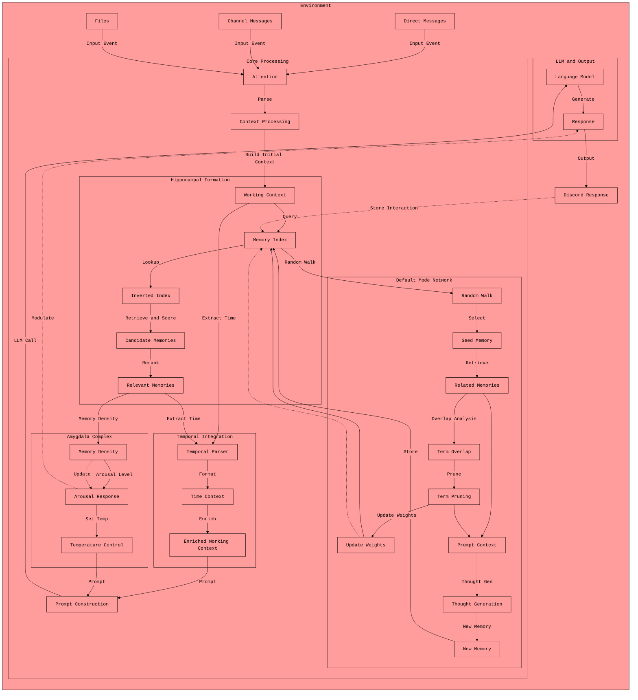

<div align="center" style="pointer-events: none;">


</div>

# defaultMODE: Emergent Self-Regulating AI Entities

`defaultMODE` is a Python framework for creating Discord-based AI agents that exhibit genuine learning and evolution over time, by focusing on at inference-time *selective attention* and *memory refinement*, drawing inspiration from abstracted models of human brain function. The emphasis is on long-term persistence and the emergence of complex behavior from simple, well-defined fundamentals. Most multi-turn/multi-user bots exhibit confusion about their role and reward signals over time, large cloud models excel at grokking who they are and the masks they wear in conversation, while smaller open source models can collapse into mirroring the 'USER' after one turn. Managing an agentic prompt context is a dark art... This cognitive framework is designed to be an "animated skeleton", where you can remove as many bones as you need to ensure even the smallest models maintain longterm coherence and shape without collapsing. 💀

# Features and Abilities

- Channel vs DM memory siloing and context switching - Intelligent context boundaries that respect privacy and conversation scope
- `Youtube` and Website grokking from shared links - Using novel "skim" reading algorithm instead of narrow chunking for holistic content understanding
- Mentioning logic for `agent 2 agent` interaction and collaboration - Based on shared experience and noted expertise for emergent team dynamics
- Easily defined prompt library - For bespoke NL persona and agent-personalising-memory "style", creating emergent preferences over time
- Discord first data conditioning - All user name logic, message limit chunking and block formatting elegantly considered for seamless integration
- Full auditing and logging suite - Comprehensive tracking in both SQL and JSONL formats for complete observability
- Neurologically-inspired memory architecture - Default Mode Network (DMN) processor creates continuous background thought generation through associative memory walks
- Adaptive emotional regulation - Integrated amygdala response system that modulates temperature, defined prompt behavior intensity, based on homeostatic memory density and context richness
- Hippocampus-style memory reranking - Hybrid lexical-semantic scoring system that blends keyword search with vector embeddings for human-like memory recall

---

<table align="center">
    <tr>
        <td width="50%">
            
        </td>
        <td width="50%" style="text-align: left; padding-left: 2rem;">
            <ul>
                <li>Continuous memory refinement through term pruning and connection weighting</li>
                <li>Dynamic temperature scaling based on memory density and amygdala response</li>
                <li>Homeostatic regulation preventing memory bloat while preserving critical knowledge</li>
                <li>Real-time semantic relationship discovery through fuzzy matching and temporal parsing</li>
                <li>Self-regulating modes (forgetful, homeostatic, conservative) for adaptive behavior</li>
            </ul>
        </td>
    </tr>
</table>

---

**Core Principles and Features: Simplicity, Emergence, and Persistence**

*   **Memory System:**
    *   **Inverted Index with TF-IDF Weighting:** A simple inverted index provides fast memory retrieval.  The *search* process incorporates an IDF (Inverse Document Frequency) weighting scheme, similar to TF-IDF, prioritizing memories with rarer, more distinctive terms. Memories are connected by shared, weighted terms.
    *   **Term Pruning:**  Overlapping terms between related memories are *removed* during reflection, forcing memories to become more strongly associated with their *unique* content.  This drives specialization and reduces generic responses.
    *   **Hippocampal Formation (Embedding-Based Reranking):**  At inference time, candidate memories are reranked using an embedding model, surfacing the most contextually relevant memories. The selection bandwidth is tied to the amygdala response.
    *   **Temporal Context Parsing:**  Time expressions are parsed as naturual language (vs timestamps) and integrated into the agent's context.
    *   **Intelligence through Selective Attention:** The system focuses on relevant information rather than comprehensive knowledge.

*   **Default Mode Network (DMN) Simulation:** A background process (`DMNProcessor`) mimics aspects of the brain's DMN:
    1.  **Memory Selection:** A random memory is chosen.
    2.  **Related Memory Retrieval:** Connected memories are identified.
    3.  **Term Pruning:** Overlapping terms are removed.
    4.  **Thought Generation:** An LLM generates a new "thought" based on the *refined* context, which is then added to the memory index.
    5.  **Memory Decay:** Memories decay as connections and are broken and weighting values reduced.
    6.  **Forgetting:**  Memories with no remaining connections are removed.
    This iterative process creates a continuously evolving internal model.

*   **Amygdala-Inspired Modulation:** An "Amygdala Complex" simulates emotional influence by adjusting the LLM's temperature.  Higher "arousal" (based on memory density) leads to more creative outputs; lower "arousal" promotes deterministic responses. This value is routed throughout the cognitive flow, `{string}` variables in prompts allow for dynamic behavior changes.

*   **Discord Embodiment:**
    *   **Context-Aware Message Processing:**  Handles messages, mentions, and context.
    *   **Multi-Agent Interaction:** Supports interactions between multiple agents.
    *   **Automated Discord Management:**  Handles regex, chunking, and formatting.

*   **LLM Integration:**
    *   **Multi-Provider Support:**  Currently supports OpenAI, Anthropic, Ollama, and vLLM.
    *   **Embedding Model Support:** Uses embedding models for reranking.
    *   **Text and Image Processing:**  Can handle both text and image inputs (more modalities to come).
    *   **File and GitHub Integration:** Processes files and GitHub repositories.

*   **Persistence and Configuration:**

    * **Memory Persistence**: User memories are semantically linked in an indexed file structure, persisting between sessions, influencing personality and evolving with agent.
    *   **File Caching:**  Manages temporary files for performance and privacy.
    *   **Configuration Storage:** Uses YAML files and environment variables for flexible and secure configuration.
    *   **Runtime Adjustable Parameters:**  Allows adjusting settings like temperature during runtime.

*   **Auditing and Monitoring:**
    *   **JSONL Logging:**  Logs all interactions for debugging, analytics, and compliance.
    *   **SQLite Database:**  Provides an operational layer for querying and analyzing interaction data.

----

**The following diagram provides a visual representation of the agent's core processes, emphasizing the interaction between attention, memory, and the DMN.**



# Name Inspiration

The name `defaultMODE` reflects two key concepts:

The name refers to the human Default Mode Network (DMN)—brain regions active during rest and introspection. Like its neurological counterpart, our framework enables background cognitive processing where the agent homeostically regulates its memory space through term pruning and connection refinement. This self-regulation prevents memory bloat while preserving critical knowledge, allowing for emergent cognitive development that mimics human "mind-wandering" during idle periods.

---

<div align="center">


</div>

---

**Getting Started**

1.  **Clone:** `git clone https://github.com/everyoneisgross/defaultmodeAGENT && cd defaultmodeAGENT`
2.  **Install:** `pip install -r requirements.txt`
3.  **Configure:** Create a `.env` file (refer to `.env.example`) and populate it with your Discord token and any necessary API keys.
4.  **Define Your Agent:** Create `system_prompts.yaml` and `prompt_formats.yaml` within the `/agent/prompts/your_agent_name/` directory. (Example files are provided.)

    ```yaml
    # Example system_prompts.yaml snippet:
    default_chat: |
      You are a curious AI entity.  Your name is {bot_name}.  You have a persistent memory and can reflect on past interactions. Your current intensity level is {amygdala_response}%. At 0% you are boring at 100% you are too much fun.
    ```

5.  **Run:** `python agent/discord_bot.py --api ollama --model hermes3 --bot-name your_agent_name`

**Technical Overview**

*   **Persistence:** Memories are persisted using a bespoke inverted-index, ensuring data is preserved between sessions and can be all held in memory for fast inference.
*   **Analysis:** JSONL logs and an SQLite database are included for auditing and analysis.
*   **Configuration:** Managed via YAML files for prompt definitions and environment variables for sensitive credentials and API keys.
*   **Code:** Python, with an emphasis on tool modularity. Abstractions will transfer to other social platforms eventually.
*   **Dependencies:** Detailed in `requirements.txt`, including libraries for Discord interaction, LLM APIs, and data handling.

---

# Further Reading:

1.  [Cognition Analogy](docs/cognitionanalogy.md)
2.  [Memory Module](docs/memory.md)
3.  [Memory Editor](docs/memory_editor.md)
4.  [Default Mode Network Flow](docs/defaultmode_flow.md)
5.  [Prompting Guide](docs/prompting.md)