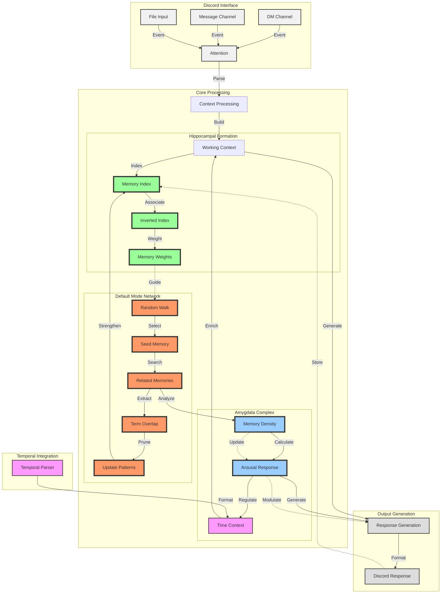
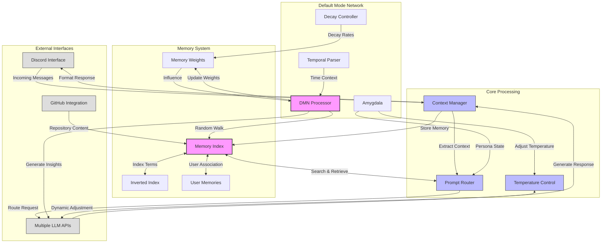
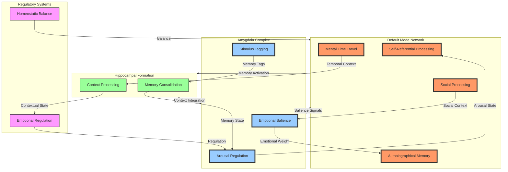

defaultMODE is a Discord framework for running persistent, self-aware agents. Unlike traditional Discord bots, our defaultMODE framework maintains a continuously updating memory index—similar to the human brain's Default Mode Network—which allows the agents to generate reflective background thoughts and maintain context over long periods. Continually compressing, expanding and pruning to maintain a homeostatic representation of their own sense of self.

The framework integrates with several language model APIs (including OpenAI, Anthropic, Ollama, and vLLM) to process both text and image inputs. It also enables multi-agent interactions through Discord's mention system, allowing agents to communicate, collaborate, and scheme together. This design simulates a collective consciousness where agents not only retain memories and conversational context but also engage in ongoing, dynamic interactions, much like human thought processes and social exchanges. 

<div align="center">


</div>

## Core Features

- **Memory System**
  - Inverted index for lightweight semantic memory storage
  - Adaptive memory pruning based on relevance weights
  - Background thought generation via DMN processor
  - Temporal context parsing for natural time expressions
  - At inference hypocampus reranking using embeddings 

- **LLM Integration**
  - Multi-provider support (OpenAI, Anthropic, Ollama, vLLM)
  - Embedding model support (OpenAI, Ollama, vLLM)
  - Text and image processing capabilities
  - Dynamic temperature control via amygdala response (0-100)
  - File and GitHub repository processing

- **Discord Embodiment**
  - Context-aware message processing
  - Mention handling (ID ↔ username conversion)
  - Dynamic user/agent tagging
  - Multi-agent interaction support

The system maintains context through an inverted index rather than embeddings, using memory weights and n-gram comparisons for semantic relationships. The DMN processor generates background thoughts and adjusts response temperature based on context density, while the amygdala system modulates response creativity from deterministic (0) to highly dynamic (100).



## Installation and Usage

### Prerequisites

- Python 3.8 or later
- Required dependencies listed in `requirements.txt`
- Environment variables configured for:
  - Discord token(s)
  - API keys for the supported LLM providers
  - Other settings as outlined in the `.env.example` file

### Installation

1. **Clone the repository:**

   ```bash
   git clone https://github.com/yourusername/your-discord-agent.git
   cd your-discord-agent
   ```

2. **Install dependencies:**

   ```bash
   pip install -r requirements.txt
   ```

3. **Set up environment variables:**  
   Create a `.env` file (or set the variables in your environment) based on the provided `.env.example`.

4. **Define your agents prompts**

    Point to or define your own agents prompts. These require specific variables to be injected into the prompts to allow the agents grok their current context. Shown in the provided agent examples.

    Bots should be defined in:

    `/agent/prompts/yr_agents_name/system_prompts.yaml`
    `/agent/prompts/yr_agents_name/prompt_formats.yaml`

    The system prompts should include the `{string}` variables that will be injected into the prompts. For more information look up the included DOCS on prompting. It will work without but you'll just get a goldfish. 🐟

### Running the Bot

You can start the bot by running:

```bash
python your_agent_script.py --api ollama --model hermes3 --bot-name YourBotName
```

Replace the arguments with your preferred API and bot name as needed.



