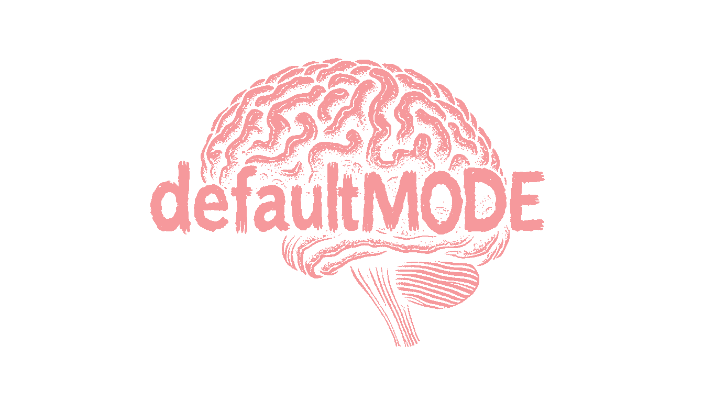

<div align="center" style="pointer-events: none;">



</div>

# defaultMODE: Emergent Self-Regulating AI Entities

`defaultMODE` is a cognitive architecture for discord agents that remember, forget, and dream.

memory systems prune and specialize through use. attention emerges from what the agent already knows. arousal modulates creativity based on context richness. a background process walks memory while idle, generating reflections, strengthening some connections, letting others decay.

local-first, model-agnostic. works with ollama, openai, anthropic, vllm, gemini. the skeleton stays coherent even when the model is small.

not just another chatbot framework. a framework for entities that persist.

[UPDATES](docs/updates.md)

----

# why defaultMODE?

multi-user chatbots lose themselves. large cloud models can hold character across long conversations, but smaller open-source models collapse—mirroring whoever spoke last, forgetting their own voice after one turn. the longer the context, the more the self dissolves.

most frameworks ignore this. they assume the model will just figure it out.

defaultMODE is an animated skeleton. 💀 the stateful cognitive architecture maintains shape even when the underlying model is small or forgetful. memory, attention, and arousal systems do the work of coherence so the model doesn't have to hold everything in context. you can strip bones out and the thing still stands.

tune `bot_config.py` when running lighter models. the framework adapts; context rot becomes optional.

---


<table align="center" width="100%">
    <tr>
        <td width="40%" valign="middle">
            
        </td>
        <td width="60%" valign="middle">
            
        </td>
    </tr>
</table>

---


# Features and Abilities

```
input → attention filter → hippocampal retrieval → reranking by embedding
                                    ↓
              context assembly ← temporal parsing ← conversation history
                                    ↓
                    amygdala samples arousal from memory density
                                    ↓
                         prompt construction → llm → response
                                    ↓
                    memory storage → thought generation → dmn integration
                                    ↑
              [background: dmn walks, prunes, dreams, forgets]
                                    │
                          orphan detected? → spike
                                    │
                   score channel surfaces (bm25 + theme resonance)
                                    │
                    viable match → outreach → reflect → memory
```

## cognitive architecture

- **default mode network** — background process performs associative memory walks, generates reflective thoughts, prunes term overlap between related memories, and manages graceful forgetting. the agent dreams between conversations.
- **spike processor** — when DMN encounters an orphaned memory (pruned to isolation, no internal connections remaining), it delegates to spike. spike scans recently-engaged channels for semantic resonance using BM25 scoring blended with theme matching. a viable match triggers unprompted outreach. every fired spike produces two memories stored under the bot's own user ID: an interaction record and a private reflection — both feed back into future DMN walks, enabling meta-cognition about its own outreach behaviour. requires `spike_engagement` prompts in both yaml files.
- **amygdala complex** — memory density modulates arousal which scales llm temperature dynamically. sparse context → careful, deterministic. rich context → creative, exploratory. emotional tone emerges from cognitive state.
- **hippocampal formation** — hybrid retrieval blending inverted index with tf-idf scoring and embedding-based reranking at inference time. bandwidth adapts to arousal level for human-like recall under pressure.
- **temporal integration** — timestamps parsed as natural language expressions ("yesterday morning", "last week") rather than raw datetime, giving the agent intuitive temporal reasoning about its memories.

## attention and engagement

- **fuzzy topic matching** — attention triggers use semantic similarity against defined interests plus emergent themes mined from memory. agents join conversations that resonate with what's already on their mind.
- **theme emergence** — preferences crystallize from interaction patterns. the agent develops interests it wasn't explicitly given, contributing to attention triggers organically.
- **distributed homeostasis** — all modules regulate each other. attention depends on themes from memory. arousal depends on memory density. memory quality depends on dmn pruning. no central controller, just coupled oscillators.

## context and memory

- **channel vs dm siloing** — memories respect privacy boundaries. dm conversations stay private to that user. channel context stays scoped to that space. context switching handled intelligently.
- **term pruning and decay** — overlapping terms between connected memories are removed during reflection, forcing specialization. memories with no remaining connections are forgotten. the index breathes.
- **persistence** — pickled inverted index survives restarts. the agent wakes up remembering.

## content ingestion

- **web and youtube grokking** — shared links scraped and processed using holistic "skim" reading rather than narrow chunking. content understood in context, not fragments.
- **file and image processing** — attachments analyzed with vision models when available. text files, code, images all flow into memory and context.
- **github integration** — repository indexing, file-specific chat, and rag-style repo questions. code becomes part of the agent's extended mind.

## discord-native design

- **message conditioning** — username logic, mention handling, reaction tracking, chunking for discord limits, code block preservation. seamless integration without fighting the platform.
- **multi-agent ready** — multiple bot instances with separate memory indices, api configurations, and personalities. they can coexist and collaborate.
- **self-invocation** — bot can invoke whitelisted commands from its own responses, enabling tool use and agentic behavior.
- **graceful degradation** — kill/resume commands, processing toggles, attention on/off. operators maintain control without losing state.

## observability

- **dual logging** — jsonl for streaming analysis, sqlite for structured queries. every interaction, thought generation, and memory operation tracked.
- **runtime adjustable** — temperature, reranking thresholds, attention sensitivity all tunable without restart. watch the agent shift in real time.


---

# setup

**prerequisites:** python 3.10+, a discord bot token, at least one LLM API key or a local ollama instance.

### 1. clone

```bash
git clone https://github.com/everyoneisgross/defaultmodeAGENT
cd defaultmodeAGENT
```

### 2. run setup

the included `setup.py` handles environment creation, dependency installation, and API key configuration in one pass.

```bash
python setup.py
```

it will:
- check your python version
- create a `.venv` virtual environment
- install all dependencies from `requirements.txt`
- walk through your `.env`, prompting for any missing API keys (discord tokens, openai, anthropic, gemini, etc.)
- auto-detect bots from `agent/prompts/` and prompt for their tokens individually

**flags:**
```bash
python setup.py --install   # venv + packages only, skip .env
python setup.py --env       # .env config only, skip venv
```

> keys already present in `.env` are skipped — safe to re-run.

### 3. create your agent

create a directory under `agent/prompts/` named after your bot:

```
agent/prompts/your_bot_name/
├── system_prompts.yaml     # required — personality, attention triggers, dmn prompts
├── prompt_formats.yaml     # required — message template formats
└── character_sheet.md      # optional — extended lore and background
```

minimal `system_prompts.yaml`:
```yaml
default_chat: |
  You are {bot_name}. You have persistent memory and reflect on past interactions.
  Your intensity is {amygdala_response}%. Your current interests are {themes}.
```

set the corresponding discord token in `.env`:
```
DISCORD_TOKEN_YOUR_BOT_NAME=your_token_here
```

### 4. launch

directly:
```bash
python agent/discord_bot.py --api ollama --model hermes3 --bot-name your_bot_name
python agent/discord_bot.py --api openai --model gpt-4o --bot-name your_bot_name
python agent/discord_bot.py --api anthropic --model claude-sonnet-4-6 --bot-name your_bot_name
```

or use the TUI manager (see below):
```bash
python run_bot.py
```

**supported APIs:** `ollama` · `openai` · `anthropic` · `gemini` · `vllm` · `openrouter`

---

# run_bot — TUI manager

`run_bot.py` is a terminal UI for launching and supervising multiple bot instances without leaving your terminal. built on [textual](https://github.com/Textualize/textual).

```bash
python run_bot.py
```

requires dependencies from `requirements.txt` to be installed first.

### tabs

| key | tab | description |
|-----|-----|-------------|
| `1` | **Launch** | select a bot, API, and model then launch. runs multiple instances simultaneously. each instance gets a live log panel with stop controls. optionally set a separate API/model for the DMN background process. |
| `2` | **Logs** | reads the JSONL log file for any bot with a cache. keyword search, auto-refresh on a configurable interval (5s / 10s / 30s). last 300 entries shown. |
| `3` | **Prompts** | view and edit `system_prompts.yaml` and `prompt_formats.yaml` for each bot directly from the TUI. |
| `4` | **Memory** | inspect, search, edit, and delete stored memories for any bot. supports find-and-replace across the full index. edits warn if the bot is currently running. |
| `5` | **Viz** | 2D latent-space map of the memory index. nodes are memories projected via TF-IDF + UMAP. navigate with `wasd` / arrow keys, zoom with `+`/`-`, select with `enter` to read memory content. |

### keyboard shortcuts

| key | action |
|-----|--------|
| `1`–`5` | switch tabs |
| `q` | quit (gracefully stops all running bots) |
| `w a s d` | navigate viz map |
| `↑ ↓ ← →` | pan viz map |
| `+ -` | zoom viz map |
| `enter` | select viz node |
| `f` | focus viz on selected node |

### dmn split-model

on the Launch tab you can assign a separate API and model specifically for the Default Mode Network. useful for running a cheap/fast local model for dreaming while the main conversation uses a cloud model, or vice versa.

---

# Further Reading:

1.  [Cognition Analogy](docs/cognitionanalogy.md)
2.  [Memory Module](docs/memory.md)
3.  [Memory Editor](docs/memory_editor.md)
4.  [Default Mode Network Flow](docs/defaultmode_flow.md)
5.  [Prompting Guide](docs/prompting.md)
6.  [Attention Triggers](docs/attention.md)